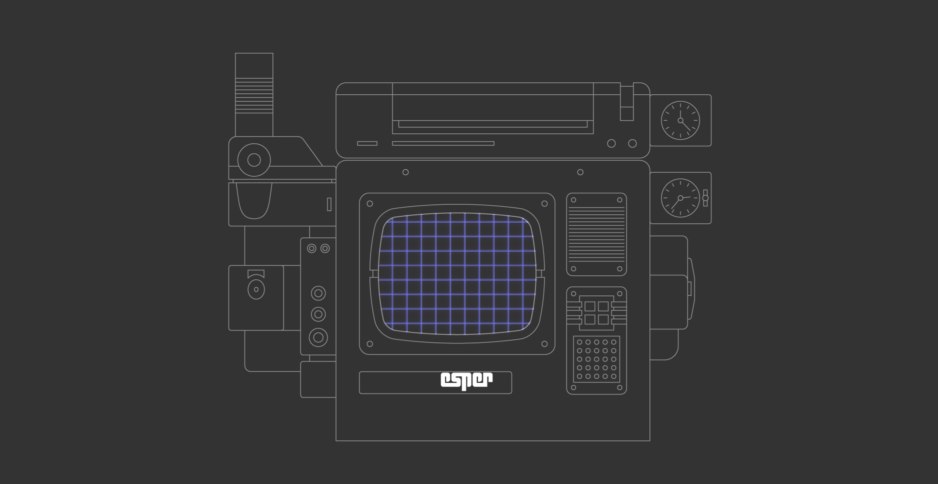
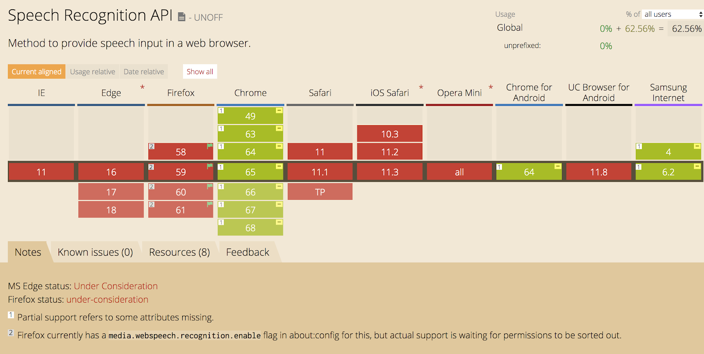

### Esper JS
Fun emulation of the ESPER Machine from the photo analysis scene in Blade Runner (1982) using HTML5 speech recognition.

---

### Usage 

:minidisc: To open an image, say "upload" and choose a high resolution JPEG / PNG photo.

:arrow_left: :arrow_right: To move left or right, say "track left" / "move left" / "track right" / "move right".

:arrow_up: :arrow_down: To move up or down, say "move up" / "move down".

:mag: To zoom, say "zoom in" / "pull in" / "zoom out" / "pull out".

:stop_button: To stop, say "stop" / "hold" / "wait"

:x: To eject or close, say "eject" / "close".

:zzz: To shutdown, say "shut down" 

:ok: Say "okay" to confirm or "cancel" to abort...

---

### Requirements

This only works in Google Chrome (Win / Mac OS) as of November 22, 2019.

---

### Reference

- [Blade Runner (1982) - IMDb](https://wwww.imdb.com/title/tt0083658/)

- [Speech Recognition in JavaScript Apps by Hasan Ahmad](https://www.dev6.com/javascript/speech-recognition-in-javascript-apps/)

- [JSpeech Grammar Format - W3C Note 05 June 2000](https://www.w3.org/TR/jsgf/)

- [MDN Web docs - SpeechGrammar](https://developer.mozilla.org/en-US/docs/Web/API/SpeechGrammar)

- [HTML5 Speech Recognition API by Kai Wedekind](https://codeburst.io/html5-speech-recognition-api-670846a50e92)

- [Track 45 left by Ken Perlin](http://blog.kenperlin.com/?p=16063)